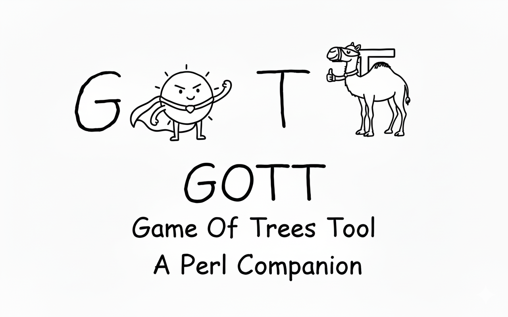
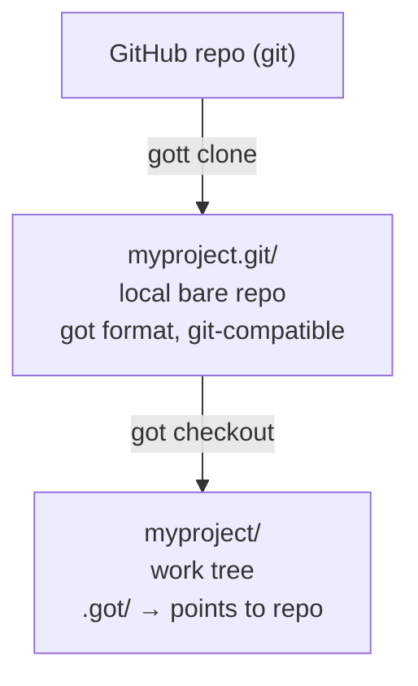
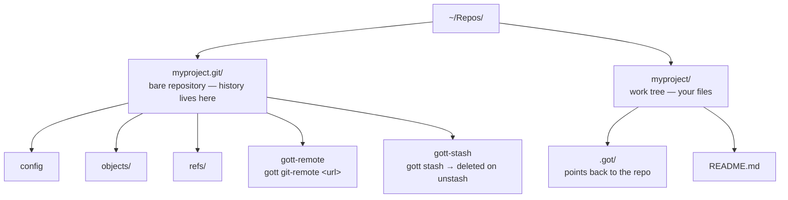

<p align="center">
  
</p>

# gott — A Third-Party CLI for Game of Trees

`gott` is a third-party command-line interface for the [Game of Trees](https://gameoftrees.org) version control system, designed to streamline common workflows. It operates as a standalone Perl-based wrapper, providing convenient shortcuts for daily tasks.

**Disclaimer:** `gott` is an independent, community-driven project. It is not affiliated with, endorsed by, or maintained by the official Game of Trees or OpenBSD development teams.

---

## The solo developer's version control solution

Version control for a solo developer or small team should be simple. A single binary, no server to maintain, no containers to update, no TLS certificates to renew. Your history lives locally, pushes to any git host when you need a backup or a collaborator, and stays out of your way the rest of the time.

got and gott are that path.

**got** gives you a version control system built on clarity: the repository and work tree are separate, commands are named after what they do, and it speaks git natively so you can push to GitHub or Sourcehut without anyone on your team changing anything. Install it with one command on any BSD or Linux system. No daemon, no database, no configuration files to learn.

**gott** sits on top of got and handles the sequences you reach for every day — starting a project, committing everything, branching, stashing work in progress — so you type less and think about the tool less.

Together they replace a self-hosted git server, a container stack, and a stash you do not trust, with two small tools and no infrastructure.

---

## Why Game of Trees?

Game of Trees (`got`) is a version control system written in C by the OpenBSD team. It is not a git replacement — it is a deliberate simplification. Where git exposes every operation in its object model, got exposes the operations developers actually need, with names that describe what they do.

A few things that set it apart:

**The repository and work tree are separate by design.**
Your bare repo lives at `myproject.git/`; your editable files live at `myproject/`. There is no `.git` folder mixed into your source tree. This is not an accident — it makes multiple simultaneous work trees trivial and keeps the repo portable.

**Commands are named after their effect.**
`got add`, `got commit`, `got revert`, `got blame`. There is no porcelain/plumbing split to memorize, no incantations to undo a staging mistake.

**It works natively with git repositories.**
got can clone from GitHub over SSH or HTTPS, fetch updates, and push commits back. Your team stays on git. You work locally with got. Nobody has to change anything.

**The codebase is small and auditable.**
The OpenBSD team has a reputation for code quality for a reason. got is software you can actually read.

---

## got + gott — the full picture

gott is got's sidekick, not its replacement. got does all the real work. gott handles the sequences you would otherwise type from memory every day, wraps the git interop flags you never quite remember, and gives names to multi-step workflows that deserve one.

You use both. got for anything precise or occasional. gott for anything you reach for without thinking.

### What gott adds to got

| Task | got alone | got + gott |
|---|---|---|
| New project (init + seed + checkout) | 7–8 commands | `gott new myproject` |
| Stage everything and commit | `got add -R . && got commit -m "..."` | `gott snap "..."` |
| New branch and switch to it | `got branch -c x && got update -b x` | `gott nb x` |
| Clone and check out | `got clone url repo && got checkout repo dir` | `gott clone url` |
| Work tree info + status together | `got info && got status` | `gott info` |
| Set aside uncommitted work safely | 6 got commands in the right order | `gott stash` |
| Restore stashed work | 4 got commands + hash lookup | `gott unstash` |
| Switch branch | `got update -b main` | `gott switch main` |
| Revert a file | `got revert file` | `gott undo file` |
| Log with colour | `got log` (monochrome) | `gott log` |
| List branches, highlight current | `got branch` (no highlight) | `gott branches` |

### What gott adds on top of got (git interop)

got speaks git natively but the flags are verbose. gott remembers them for you.

| Task | got alone | got + gott |
|---|---|---|
| Register git upstream | Edit config manually | `gott git-remote <url>` |
| Fetch from GitHub | `got fetch -r url -R repo` | `gott git-pull` |
| Push to GitHub | `got send -b branch -r url` | `gott git-push` |
| Fetch + rebase in one step | Two commands + remember remote | `gott sync` |
| Export commits as patch files | `got diff -c <hash>` per commit, redirect to file | `gott patch 3` |
| Apply a patch from a teammate | `patch -p1 < file` | `gott apply file.patch` |

### What you still use got for directly

gott does not try to cover everything. Some got commands are already clear enough on their own:

- `got log -p` — patch view of history
- `got blame <file>` — line-by-line authorship
- `got cat -c <hash> <file>` — read a file at a specific commit
- `got update -c <hash>` — move work tree to a specific commit
- `got backout <hash>` — undo a commit with a new revert commit
- `got rebase -c` / `got rebase -a` — continue or abort a rebase
- `got branch -d <name>` — delete a branch
- `tog` — terminal UI for browsing history

The split is simple: gott for the things you do every day without looking them up, got for everything else.

---

## got vs. self-hosted Gitea + Podman

| | Gitea + Podman | got |
|---|---|---|
| Setup time | Hours (container, nginx, TLS, DNS) | Minutes (`apt install` or `dpkg -i`) |
| Ongoing maintenance | Container updates, backups, uptime | None |
| Team access | HTTP/SSH through your server | Push to GitHub/Sourcehut/any git host |
| Local history | git inside container | Native, no network required |
| Disk footprint | ~300 MB image + DB | ~2 MB binary |
| Offline work | Requires your server to be up | Fully local |
| Stash | git stash (opaque stack) | Branch-based, inspectable, explicit |
| Learning curve | git + Docker + admin | Commands read as plain English |

The honest answer: if you need an issue tracker, pull request UI, or team code review workflow, Gitea is the right tool. If you need version control for your own projects with the option to push to a git host for backup or collaboration, got removes every layer of overhead between you and your files.

---

## Use gott as your stash inside a git project

You do not need to migrate your project to got to get value from it. If your team uses git and GitHub, you can use `gott` purely as a local stash tool — a better `git stash` — while everyone else keeps working normally.

### The moment git stash becomes a liability

You know the situation. You have been working on a feature for two hours. Your branch is behind `main` by eleven commits because the team has been busy. Your tech lead messages you: "can you fix the payment bug, it's blocking QA." You have seven modified files, two new files not yet staged, and one file you are halfway through editing.

You reach for `git stash`. And then the doubt starts.

```
Did git stash pick up the untracked files? (Only with -u. Did you use -u?)
Is stash@{0} the one from this morning or from last week?
If I rebase after stashing, will pop still apply cleanly?
What happens if pop has conflicts — does it consume the stash entry or leave it?
If I run git stash drop by mistake, is it gone forever?
```

The answers are: sometimes, impossible to tell, maybe, it depends, yes.

None of this is hypothetical. Every developer who has used git stash in a hurry has either lost work or spent twenty minutes untangling a stash-pop conflict on a file that was also modified by the rebase. The fear is rational. git's stash implementation is not designed for the panicked, multi-context workday.

### Why git stash falls short

`git stash` is a stack. It works for the simple case, but:

- Stashes are unnamed by default. `git stash list` quickly becomes `stash@{0}`, `stash@{1}`, `stash@{2}` with no memory of what each was for.
- Untracked files are excluded unless you pass `-u`. Easy to forget under pressure.
- `git stash pop` on a dirty tree can fail with conflicts. When it does, the stash entry may or may not have been consumed — you have to check.
- After a rebase, the patch that stash recorded against the old base may not apply cleanly to the new one. Conflict resolution on top of a just-rebased branch, on uncommitted work, is one of the most stressful positions in git.
- The underlying storage is a synthetic merge commit grafted onto `refs/stash` — opaque, unbranchable, unshareable.
- `git stash drop` or `git stash clear` is permanent. No recovery.

### Why gott stash is safer

The fundamental difference is that `gott stash` makes a real commit on a real named branch. Every guarantee that applies to commits applies to your stash:

- **It is visible.** `got branch` shows it. `got log -b _stash_...` shows exactly what is in it.
- **It cannot be lost by accident.** There is no `drop` or `clear` command. The branch exists until you run `got branch -d` deliberately.
- **Untracked files are always included.** `gott stash` runs `got add -R .` before committing. No flags to remember.
- **Rebasing does not touch it.** The stash branch is independent of your main branch. A rebase on `main` does not affect it at all.
- **Unstashing is a cherry-pick, not a patch apply.** got cherry-picks the commit onto your current tree state. If there is a conflict, it tells you cleanly — and the stash branch is still there, intact, until you resolve it.
- **You can stash multiple times.** Each `gott stash` creates a new timestamped branch. They accumulate. `got branch` lists them all.

### The got alternative

got's stash is just a commit on a named branch. You can see it, diff it, cherry-pick parts of it, or leave it sitting for a week with no risk of losing it. `gott stash` and `gott unstash` wrap this into two commands.

### Setup: add got alongside your git project

Your existing `.git` folder is untouched. got gets its own parallel bare repo.

```bash
# You are already inside your git project
cd ~/projects/myapp

# Initialise a got repo alongside it (outside the project dir)
got init ~/projects/myapp.got

# Import the current state — this is a one-time snapshot, not a migration
got import -m "import for stash use" -r ~/projects/myapp.got .

# Check it out — got needs a separate work tree
# We point it at a temp location; you will never work there directly
got checkout ~/projects/myapp.got /tmp/myapp-got-wt

# Register the work tree location for gott
# (gott reads .got/repository; this is what checkout creates)
# You will run gott from /tmp/myapp-got-wt, or symlink it
```

A simpler approach for stash-only use: just run `gott stash` and `gott unstash` from the got work tree, then copy the changed files back to your git project manually. Or keep the got work tree at `~/projects/myapp-got` and use it as your primary editor location — git never sees the `.got` folder, so nothing breaks.

The cleanest setup for solo use:

```bash
# One-time
got init ~/Repos/myapp.got
got import -m "init" -r ~/Repos/myapp.got ~/projects/myapp/.
got checkout ~/Repos/myapp.got ~/projects/myapp-got
cd ~/projects/myapp-got
gott git-remote git@github.com:you/myapp.git
```

After that, `~/projects/myapp-got` is where you edit. git and got coexist — git does not know about got's work tree, and got does not know about `.git`.

### The stash workflow

```
You are mid-feature. An urgent bug report arrives.
Your editor has half-finished changes across four files.
```

**With git stash:**

```bash
git stash push -m "half-finished auth refactor"
# ... fix the bug ...
git stash pop
# Hope for no conflicts. Stash is gone either way.
```

**With gott stash:**

```bash
cd ~/projects/myapp-got

gott stash
# → commits everything to branch _stash_20260215-143201
# → your work tree is clean

# Switch context — fix the urgent bug in your git work tree if preferred,
# or do it right here in the got work tree:
gott snap "fix: null pointer in payment handler"
gott git-push                   # pushed to GitHub as normal

# Come back whenever you are ready — minutes or days later
gott unstash
# → cherry-picks the stash commit onto your current branch
# → unstages everything so you review before committing
# → deletes the _stash_ branch automatically
```

### What the stash branch gives you that git stash does not

```bash
# While stashed, you can inspect exactly what is there:
got log -b _stash_20260215-143201

# Diff the stash against main:
got diff main _stash_20260215-143201

# Cherry-pick only one file from the stash — impossible with git stash:
got cherrypick <stash-commit-hash>
got revert src/api/auth.js      # keep only the file you want

# Keep multiple stashes by simply not unstashing yet:
gott stash                      # creates _stash_20260215-150000
# Each has a unique timestamp name, visible in: got branch
```

### Recovering if something goes wrong

`gott unstash` uses `got cherrypick`, which keeps the stash branch alive until the cherry-pick succeeds. If something fails:

```bash
# The stash branch is still there — nothing is lost
got branch                      # you will see _stash_YYYYMMDD-HHMMSS

# Inspect it
got log -b _stash_20260215-143201

# Try again manually
got cherrypick <hash>

# Or just diff and copy the changes by hand — they are normal files on a branch
got checkout ~/Repos/myapp.got ~/projects/myapp-recovery -b _stash_20260215-143201
```

The stash branch stays in your repository history, visible and recoverable, until you explicitly delete it with `got branch -d`.

---

## Working with a git team while using got locally

This is the real strength of the combination. Your team works on GitHub. You work locally with got. No one notices the difference.



### One-time setup

```bash
# Clone a GitHub project
gott clone git@github.com:yourteam/api.git

cd api

# Register the upstream git remote once
gott git-remote git@github.com:yourteam/api.git
```

### Daily team workflow

```bash
# Start your day: pull team changes and rebase your work on top
gott sync

# Branch and work locally with got
gott nb feature/auth-refresh        # new branch, switched immediately
# ... edit files ...
gott snap "add token refresh endpoint"
gott snap "add tests for refresh"

# Push to GitHub for review as usual
gott git-push feature/auth-refresh
```

Your teammates open a pull request on GitHub as usual. They never need to know you used got.

### Receiving patches from teammates

```bash
# A teammate emails you a patch, or you download one from GitHub's .patch URL
gott apply 0001-fix-null-check.patch
gott snap "apply: null check fix from Maria"
```

### Sending patches to teammates

```bash
# Export your last 3 commits as numbered patch files
gott patch 3
# Produces: 0001-abcd1234.patch  0002-ef567890.patch  0003-12ab3456.patch

# Teammates apply them with:
# git am *.patch
```

---

## got workflows, before and after gott

These are real tasks from a typical got session. The got commands are not hard — but `gott` reduces the steps you have to remember, especially for operations you do dozens of times a day.

### Start a new project

**By hand with got:**

```bash
export GOT_AUTHOR="You <you@example.com>"
got init ~/Repos/myproject.git
mkdir -p ~/Repos/myproject
cd ~/Repos/myproject
echo "# myproject" > README.md
got import -m "Initial import" -r ~/Repos/myproject.git .
rm -rf ~/Repos/myproject/*
got checkout ~/Repos/myproject.git ~/Repos/myproject
cd ~/Repos/myproject
```

Eight commands, one easy mistake (forgetting to clear the directory before checkout).

**With gott:**

```bash
export GOT_AUTHOR="You <you@example.com>"
gott new myproject
cd ~/Repos/myproject
```

Three commands. The import, wipe, and checkout happen in the right order automatically.

---

### Commit everything quickly

**By hand:**

```bash
got add -R .
got commit -m "fix typo in docs"
```

**With gott:**

```bash
gott snap "fix typo in docs"
```

One command. The difference is small but it adds up across a day of small commits. `snap` is the command you reach for without thinking.

---

### Go back to a specific commit (read-only inspection)

This one `gott` does not wrap — use got directly. The raw command is clear enough:

```bash
got update -c <commit-hash>     # switch work tree to that commit
got cat -c <commit-hash> <file> # read a file at that commit without switching
got update -b main              # return to your branch
```

---

### Undo a commit (keep it in history as a revert)

**By hand:**

```bash
got backout <commit-hash>
```

**With gott:**

Not wrapped — `got backout` is already a single clear command. gott does not add a shortcut for operations that are already simple.

---

### View history and understand changes

**By hand:**

```bash
got log
got log -p          # with diffs
got log -l 10       # last 10
got blame <file>
```

**With gott:**

```bash
gott log            # same output, with colour: hashes in yellow, Author/Date in cyan
got log -p          # use got directly for patch view — gott log is for scanning
got blame <file>    # use got directly; gott adds nothing here
```

Colour is the main thing `gott log` adds. When scanning fifty commits for a regression, yellow hash lines are faster to parse than a wall of uniform text.

---

### Branch and switch

**By hand:**

```bash
got branch -c feature/payments
got update -b feature/payments
```

**With gott:**

```bash
gott nb feature/payments        # create + switch in one step
```

For switching to an existing branch:

```bash
got update -b main              # raw got
gott switch main                # gott — same number of words, easier to remember
```

---

### Multiple work trees from one repo

This is a pure got feature that needs no wrapper. One of got's most useful and underused capabilities:

```bash
# Your main work tree
got checkout ~/Repos/myproject.git ~/Repos/myproject

# A second work tree for a long-running experiment — same repo, different directory
got checkout ~/Repos/myproject.git ~/Repos/myproject-experiment

# Both work trees share the same history and branches
# Changes committed in one are immediately visible in the other via got update
```

No stashing required to switch context. No detached HEAD states. Just two directories, both pointing at the same bare repo.

---

### The tog terminal UI

`tog` ships with got. It is a terminal interface for browsing history, diffs, and blame — faster than running `got log -p` repeatedly in a hurry:

```bash
tog             # opens history view
tog log         # commit log with diff inline
tog diff        # current diff
tog blame <f>   # annotated file view
```

`gott` does not wrap tog because it already has a good interface. Open it directly when you want to browse rather than scan.

---

## Limitations

got is honest about what it does not cover:

- **No hosting UI.** It is a local tool. Push to GitHub, Sourcehut, or Codeberg for a web interface.
- **No git LFS.** Large binary files need a separate solution.
- **No native Windows port.** Works on OpenBSD, FreeBSD, NetBSD, Linux, macOS, and WSL2.
- **`gott unstash`** restores the most recent stash only — use `got cherrypick` directly to pick an older stash branch by hand.
- **`tog`** (the built-in terminal UI) is minimal compared to `tig` or `gitk`.
- **Rebase conflicts** require resolving through got directly (`got rebase -c` / `got rebase -a`); gott cannot automate that.

---

## Requirements

- Perl 5.10 or later (present on every Linux system)
- `got` installed and in your `$PATH`
- `GOT_AUTHOR` set in your environment

### Install got

got is a first-class citizen of OpenBSD and well-packaged across the BSD family. Linux and macOS support comes through got-portable.

**OpenBSD** — got ships with the base system:

```
pkg_add got
```

**FreeBSD**

```bash
pkg install got
```

**NetBSD** (via pkgsrc)

```bash
pkgin install got
```

**Debian / Devuan / Ubuntu** — a pre-built amd64 .deb is included in `builds/`:

```bash
sudo dpkg -i builds/got_0.121-portable-1_amd64.deb
```

Or from the distro package if a recent version is available:

```bash
sudo apt install got
```

**Windows Subsystem for Linux (WSL)**

WSL2 runs a real Linux kernel — install got exactly as you would on Debian or Ubuntu:

```bash
sudo dpkg -i builds/got_0.121-portable-1_amd64.deb
# or
sudo apt install got
```

WSL1 uses a syscall compatibility layer and is untested, but basic operations should work. WSL2 is recommended.

**Arch Linux**

```bash
pacman -S got
```

**Alpine Linux**

```bash
apk add got
```

**Void Linux**

```bash
xbps-install got
```

**NixOS**

```bash
nix-env -i got
```

**macOS (Homebrew)** — dependencies handled automatically:

```bash
brew install got
```

**Fedora / RHEL / any distro without a package — build from source**

```bash
# Fedora / RHEL dependencies
sudo dnf install gcc make pkg-config openssl-devel ncurses-devel \
    zlib-devel libbsd-devel libmd-devel libevent-devel uuid-devel bison

# Debian / Ubuntu dependencies (if building instead of using the .deb)
sudo apt install build-essential pkg-config libssl-dev zlib1g-dev \
    libncurses-dev libmd-dev libbsd-dev uuid-dev libevent-dev bison

wget https://gameoftrees.org/releases/portable/got-portable-0.121.tar.gz
tar xzf got-portable-0.121.tar.gz
cd got-portable-0.121
./configure --prefix=/usr/local
make
sudo make install
```

### Set your identity

```bash
export GOT_AUTHOR="Your Name <you@example.com>"
# Add to ~/.bashrc or ~/.profile to make it permanent
```

---

## Installing gott

### From CPAN

```bash
cpanm App::gott
```

### From source

```bash
perl Makefile.PL
make
make test
sudo make install
```

### Manual

```bash
chmod +x gott
sudo sh install.sh
```

---

## Command reference

### Local workflow

| Command | What it does |
|---|---|
| `gott new <name> [dir]` | Init bare repo + work tree in one step |
| `gott clone <url> [dir]` | Clone and check out (got clone + checkout) |
| `gott snap [msg]` | `got add -R .` then `got commit` |
| `gott log` | Colour-highlighted log |
| `gott branches` | List branches, current highlighted in green |
| `gott nb <branch>` | Create branch and switch to it |
| `gott switch <branch>` | Switch to existing branch |
| `gott undo [file]` | Revert file or all uncommitted changes |
| `gott info` | `got info` + `got status` together |

### Git interoperability

| Command | What it does |
|---|---|
| `gott git-remote [url]` | Show or set the upstream git remote URL |
| `gott git-pull` | Fetch from git remote into local got repo |
| `gott git-push [branch]` | Push got commits upstream to git remote |
| `gott sync` | Fetch + rebase current branch on origin/main |
| `gott patch [n]` | Export last n commits as numbered `.patch` files |
| `gott apply <file>` | Apply a `.patch` file with `patch -p1` |
| `gott stash` | Commit changes to a temp branch, restore clean state |
| `gott unstash` | Cherry-pick stash back, leave changes unstaged |

---

## Repository layout



One repo, multiple work trees:

```bash
got checkout ~/Repos/myproject.git ~/Repos/myproject-experiment
```

---

## got quick reference

```bash
# Daily
got status              # what changed?
got diff                # see changes
got add <file>          # stage file
got add -R .            # stage all recursively
got commit -m "msg"     # commit

# History
got log                 # commits
got log -p              # with diffs
got blame <file>        # who changed what

# Branches
got branch              # list
got branch -c <name>    # create
got branch -d <name>    # delete
got update -b <name>    # switch

# Undo
got revert <file>       # discard uncommitted changes
got revert .            # discard all
got unstage <file>      # unstage

# Inspect
got tree                # file tree at HEAD
got cat <file>          # file content at HEAD
got cat -c <hash> <f>   # file at specific commit
got info                # work tree info
```

---

## Why Perl?

Perl ships with every serious Unix system. A Perl script from 2001 runs unmodified on a fresh Debian install today. For a CLI tool — something you copy to `/usr/local/bin` and forget about — that reliability matters more than it sounds.

The alternative is a shell script, which works until you need real error handling, piped output parsing, or coloured terminal output without external dependencies. Perl handles all of that cleanly, with no runtime to install, no virtual environment, and no version manager to maintain.

---

## Contributing — code structure for non-Perl developers

`gott` is a single file (`gott`) written to be readable and editable by anyone comfortable with shell scripting. You do not need to know Perl well to add a command or change behaviour.

### Adding a command

Two steps:

**1. Add one line to `@COMMANDS` near the top of the file:**

```perl
{ name => 'mycommand', group => 'local', usage => '<arg>', desc => 'What it does', code => \&cmd_mycommand },
```

Fields:
- `name` — what the user types: `gott mycommand`
- `group` — `'local'` or `'git'` (controls which section it appears in under `gott help`)
- `usage` — argument hint shown in help, e.g. `'<branch>'` or `'[msg]'`
- `desc` — one-line description shown in help
- `code` — `\&cmd_mycommand` links to the sub you write in step 2

**2. Write a sub below the `@COMMANDS` block:**

```perl
sub cmd_mycommand {
    my ($arg) = @_;                          # arguments from the command line
    die "Usage: gott mycommand <arg>\n" unless $arg;
    worktree_or_die();                       # optional: fail if not inside a got repo
    run( 'got', 'somecommand', $arg );       # run a got command
    print "Done: $arg\n";
}
```

That is all. Help output and dispatch are updated automatically.

### Helpers available in the script

| Helper | What it does |
|---|---|
| `run('cmd', 'arg', ...)` | Run a command, die on failure |
| `capture('cmd args')` | Run a command, return its output as a string |
| `worktree_or_die()` | Die with a clear message if not inside a got work tree |
| `author_required()` | Die if `GOT_AUTHOR` is not set |
| `git_required()` | Die if `git` is not on `$PATH` |
| `current_branch()` | Return the current branch name as a string |
| `repo_path()` | Return the path to the bare `.git` repo |
| `timestamp()` | Return a sortable timestamp string like `20260215-143201` |
| `_read_file($path)` | Read one line from a file, return it chomped |
| `_write_file($path, $content)` | Write one line to a file |
| `_do_rebase($base)` | Run `got rebase`, print conflict hints on failure |
| `green/cyan/yellow/red/bold($text)` | Colour a string for terminal output |

### Running the tests

No `make` required — run tests directly with Perl:

```bash
perl t/00-syntax.t      # syntax check
perl t/01-help.t        # help output
perl t/02-errors.t      # bad-argument handling
perl t/03-gitinterop.t  # git interop error paths
```

Tests use only core Perl modules (`Test::More`, `File::Temp`, `Cwd`). No `got` installation required — tests stub it automatically.

### Configuration

One variable at the top of `gott` controls the default repo location:

```perl
our $DEFAULT_REPO_DIR = $ENV{HOME} . '/Repos';
```

Change it if you prefer a different directory for `gott new`.

### File layout

```
gott            # the script — single file, everything is here
t/              # tests, one file per concern
Makefile.PL     # CPAN packaging (auto-generates Makefile, MYMETA.*)
install.sh      # manual install without make
builds/         # pre-built got .deb for Debian/Ubuntu/Devuan
assets/         # logo
```

`MYMETA.json` and `MYMETA.yml` are generated by `perl Makefile.PL` and should not be committed or edited.

---

## License

BSD-2-Clause. See [LICENSE](LICENSE).

## Author

Luciano Federico Pereira — lucianopereira@posteo.es
